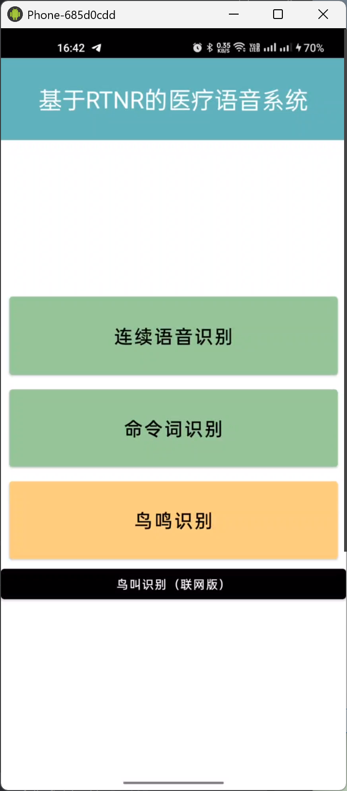
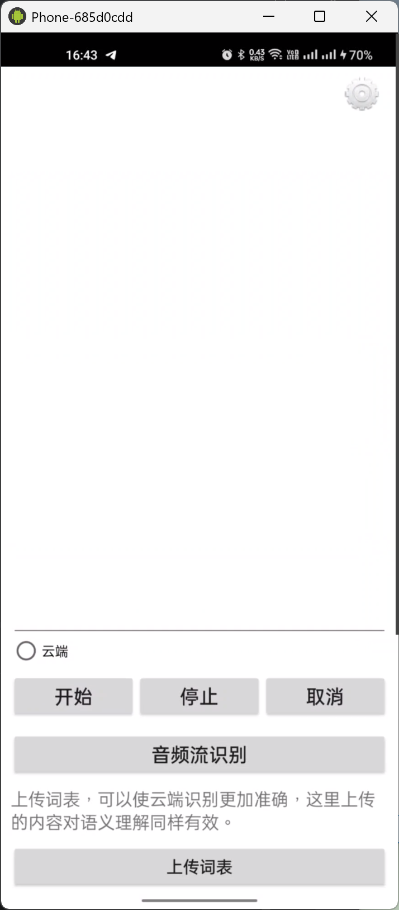
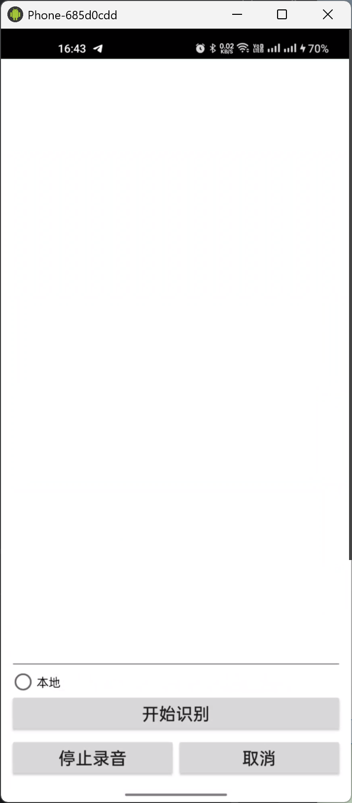

# 基于 RTNR 的医疗语音系统

一个面向 Android 平台的医疗语音交互示例项目，集成讯飞语音能力、RTNR 实时降噪模块和鸟鸣识别功能。项目支持连续语音识别、命令词识别、联网鸟叫识别，并保留了语音合成、唤醒等示例能力，适合作为医疗语音输入、语音命令控制和移动端音频智能处理的学习与二次开发基础。

## 项目截图







## 功能特性

- 连续语音识别：基于讯飞语音 SDK 实现语音转文字能力。
- 命令词识别：支持本地语法与命令词识别场景。
- 实时录音处理：通过 Android `AudioRecord` 采集音频并生成 WAV 文件。
- RTNR 降噪模块：内置 TensorFlow Lite 模型 `nunet_lstm.tflite`，用于实时噪声抑制研究与扩展。
- 鸟鸣识别：集成 BirdNET 相关模型资源，并提供联网版鸟叫识别入口。
- Android 原生实现：使用 Java、Gradle、AndroidX、OkHttp 和 Gson 构建。

## 技术栈

- 开发语言：Java
- 构建工具：Gradle / Android Gradle Plugin 8.7.0
- Android SDK：`compileSdk 35`，`minSdk 26`，`targetSdk 35`
- 主要依赖：AndroidX AppCompat、Material Components、ConstraintLayout、OkHttp、Gson
- 语音能力：讯飞 MSC SDK
- 模型资源：TensorFlow Lite、BirdNET、RTNR 降噪模型

## 项目结构

```text
.
├── app/                         # Android 主应用模块
│   ├── libs/                    # 讯飞 SDK Jar 与原生库
│   └── src/main/
│       ├── assets/              # 语音、语法、BirdNET 模型等资源
│       ├── java/com/example/testapp/
│       │   ├── MainActivity.java
│       │   ├── IatDemo.java
│       │   ├── AsrDemo.java
│       │   ├── TtsDemo.java
│       │   ├── BirdActivity.java
│       │   └── BirdRecognizer.java
│       └── res/                 # 布局、图片、字符串与主题资源
├── RTNR/                        # RTNR 实时降噪相关模块
│   └── src/main/
│       ├── assets/nunet_lstm.tflite
│       └── java/com/dl/rtnr/
├── gradle/                      # Gradle Wrapper 与版本配置
├── 基于RTNR的医疗语音系统-1.png
├── 基于RTNR的医疗语音系统-2.png
└── 基于RTNR的医疗语音系统-3.png
```

## 环境要求

- Android Studio Ladybug 或更新版本
- JDK 17 或兼容 Android Gradle Plugin 8.7.0 的 JDK
- Android SDK Platform 35
- 可用的 Android 设备或模拟器
- 录音权限与网络权限

## 快速开始

1. 克隆或下载项目到本地。

2. 使用 Android Studio 打开项目根目录。

3. 等待 Gradle 同步完成。

4. 检查讯飞语音配置。

   项目中的 `app/src/main/res/values/strings.xml` 包含 `app_id`，请根据自己的讯飞开放平台应用配置进行替换。

5. 配置鸟叫识别 Token。

   如需使用联网版鸟叫识别，请将 `app/src/main/java/com/example/testapp/BirdRecognizer.java` 中的 `YOUR_BIRDWEATHER_STATION_TOKEN` 替换为自己的服务 Token。

6. 运行调试包。

```bash
./gradlew assembleDebug
```

Windows 环境可使用：

```powershell
.\gradlew.bat assembleDebug
```

7. 安装并启动应用。

   首次进入应用时需要同意隐私提示，并授予录音权限。

## 权限说明

项目在 `AndroidManifest.xml` 中声明了以下权限：

- `INTERNET`：用于联网语音服务或鸟叫识别接口请求。
- `RECORD_AUDIO`：用于语音识别、录音采集和音频分析。

## 使用说明

- 连续语音识别：点击首页的“连续语音识别”，进入语音听写页面。
- 命令词识别：点击首页的“命令词识别”，进入本地语法识别页面。
- 鸟叫识别：点击首页的“鸟叫识别（联网版）”，录制音频后上传并获取识别结果。
- RTNR 降噪：`RTNR` 模块中提供基于 TFLite 的实时降噪核心逻辑，可按业务需求接入主应用音频链路。

## 注意事项

- 请勿将真实的第三方平台密钥、Token 或 AppID 直接提交到公开仓库。
- 联网识别能力依赖外部服务，运行前请确认网络可用且接口凭据有效。
- 录音相关功能需要在真机或支持麦克风输入的模拟器上测试。
- 如果 Gradle 同步失败，请确认 Android SDK、JDK 和 Maven 仓库网络环境是否正常。

## 许可证

本项目用于学习、课程设计和功能验证。如需商用或公开发布，请自行确认讯飞 SDK、模型文件和第三方服务的授权范围。
